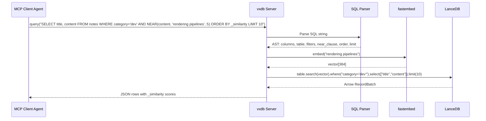
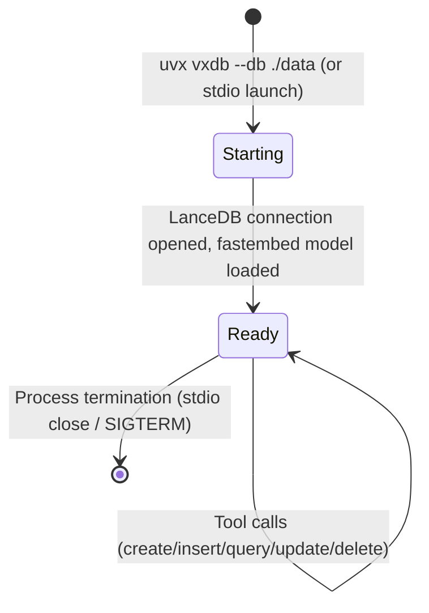

<!-- status: locked -->
<!-- epic-slug: vxdb -->
# Core Flows: vxdb

## Flow 1: Table Creation

```
Agent ──create_table──► vxdb server
                          │
                          ├─ Parse schema (validate types, identify text:embed columns)
                          ├─ Map simple types → Arrow types
                          ├─ Add hidden _vector column for each text:embed column
                          ├─ Create LanceDB table on disk
                          │
                          ◄── Success: table name + schema confirmation
                          ◄── Error: table already exists / invalid schema
```

**Preconditions**: Server running, DB directory exists
**Postconditions**: Table exists on disk with schema, ready for inserts
**Error states**: Table name collision, invalid type in schema, disk write failure

## Flow 2: Insert

```
Agent ──insert──► vxdb server
                    │
                    ├─ Validate rows against table schema
                    ├─ For each text:embed column: compute embedding via fastembed
                    ├─ Auto-generate _id (UUID) for each row
                    ├─ Attach vectors + IDs to rows
                    ├─ Batch insert into LanceDB table
                    │
                    ◄── Success: count of rows inserted + list of _id values
                    ◄── Error: schema mismatch / table not found
```

**Preconditions**: Table exists with defined schema
**Postconditions**: Rows persisted on disk, embeddings stored alongside data, each row has unique _id
**Invariant**: Every row with a `text:embed` column has a corresponding vector — no orphaned text without embeddings. Every row has a `_id`.

## Flow 3: Query (the core flow)



**Preconditions**: Table exists, columns referenced exist in schema
**Postconditions**: No state change (read-only)

**Key behaviors**:
- `NEAR(column, 'text', k)` is a WHERE predicate only — it embeds the text at query time and filters to k nearest neighbors
- `NEAR()` produces a `_similarity` virtual column in the result set, available for ORDER BY or inspection
- **`_similarity` only exists when NEAR() is present.** `ORDER BY _similarity` without a NEAR() clause is a parse error, not a silent null sort.
- One NEAR() per query. Multiple NEAR() clauses produce a clear parse error (LanceDB searches one vector index per query; multi-vector fusion is a v2 concern).
- Without NEAR(), it's a pure metadata filter query (no embedding computed, no `_similarity` column)
- Column selection via SELECT (or `*` for all)
- LIMIT and ORDER BY work as in SQL
- Empty results return `[]` — not an error. "No matching data" is a valid answer.

## Flow 4: Update

```
Agent ──update──► vxdb server
                    │
                    ├─ Parse WHERE filter to identify target rows
                    ├─ Apply column updates
                    ├─ If text:embed column changed: recompute embedding
                    ├─ Write updated rows to LanceDB
                    │
                    ◄── Success: count of rows updated
                    ◄── Error: table not found / invalid filter
```

**Preconditions**: Table exists, target rows exist
**Postconditions**: Updated rows persisted, embeddings recomputed if text changed
**Invariant**: Embedding always reflects current text — no stale vectors after update

Target rows by `_id` or by filter. `_id` targeting is recommended for single-row updates.

## Flow 5: Delete

```
Agent ──delete──► vxdb server
                    │
                    ├─ Parse WHERE filter (or _id)
                    ├─ Delete matching rows from LanceDB
                    │
                    ◄── Success: count of rows deleted
                    ◄── Error: table not found / invalid filter
```

Target rows by `_id` or by filter.

## Flow 6: Housekeeping

```
Agent ──list_tables──► vxdb: return table names from LanceDB connection
Agent ──drop_table──►  vxdb: drop table + delete from disk
```

**drop_table** is destructive — data is permanently removed.

## Flow 7: Server Lifecycle



**Key constraints**:
- fastembed model loading happens once at startup (cold start cost). All subsequent embeddings are fast inference.
- Embedding model configurable via `--embedding-model` flag, default `BAAI/bge-small-en-v1.5`.
- One model per server instance, chosen at startup. Not per-table.

## Error Contract

All errors are structural, not data-level:
- **Table not found**: Named table doesn't exist
- **Table already exists**: create_table collision
- **Schema mismatch**: Insert data doesn't match table schema
- **Parse error**: Invalid SQL syntax, invalid NEAR() usage, `_similarity` without NEAR(), multiple NEAR() clauses
- **Invalid type**: Unknown type in schema definition
- **Disk error**: LanceDB can't write/read (permissions, disk full)

"No matching rows" is never an error — it's an empty result set `[]`.
